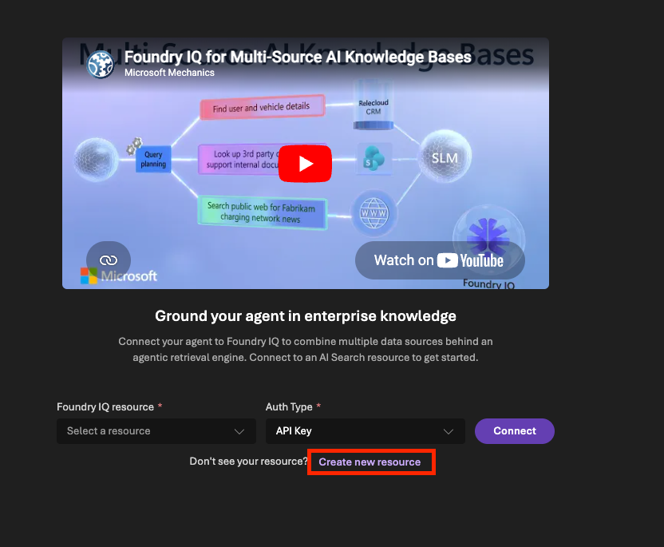
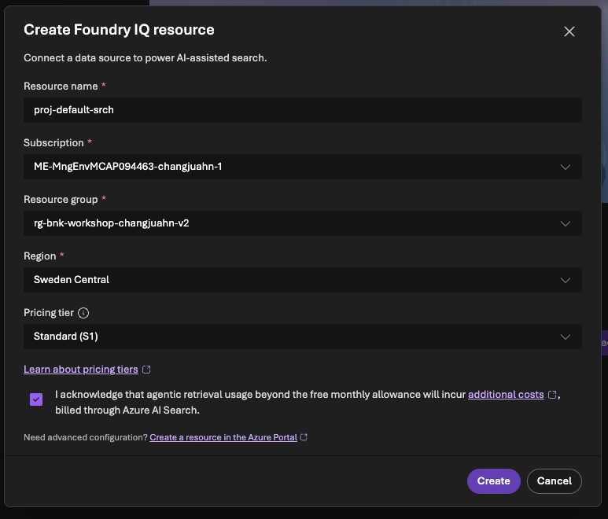
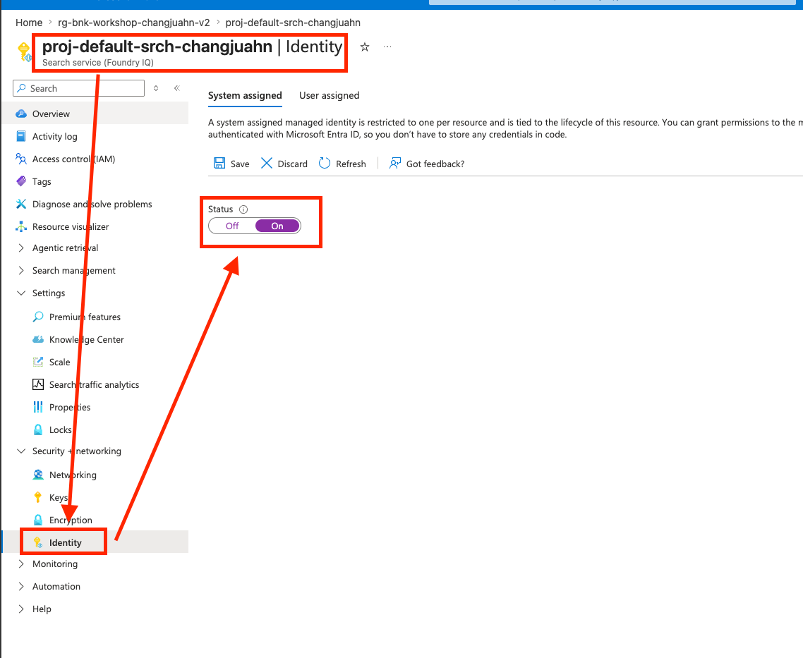
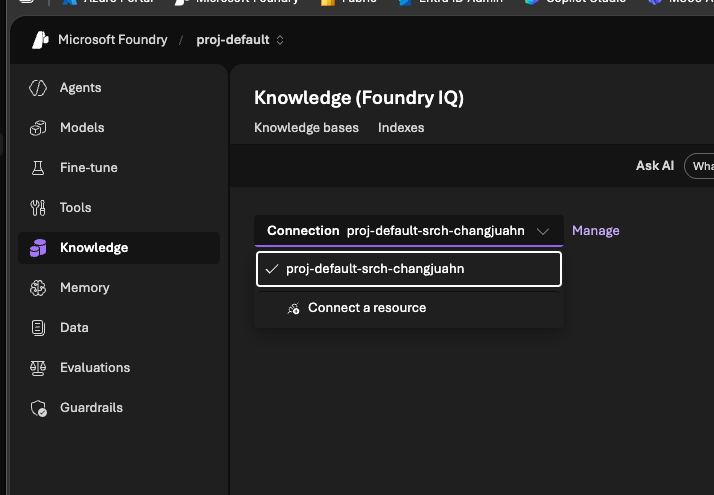
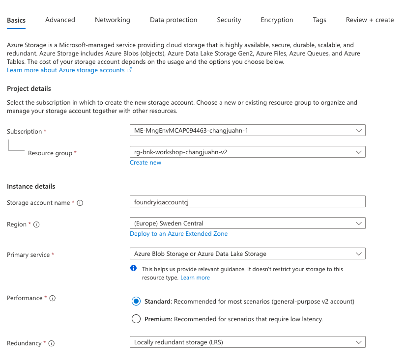
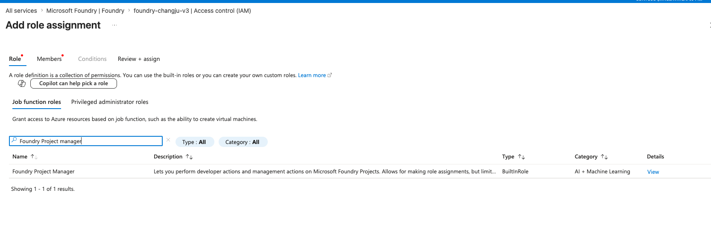
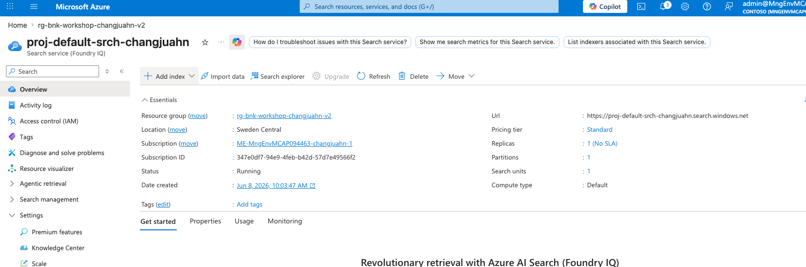
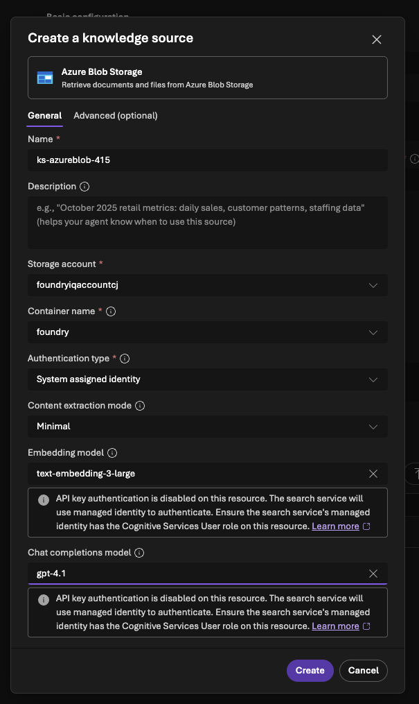

# 05. Foundry IQ

이 모듈에서는 Microsoft Foundry IQ를 활용하여 고급 지식 기반을 구축하고 에이전트와 통합하는 방법을 학습합니다.

## 📋 목차

- [Foundry IQ 개요](#foundry-iq-개요)
- [AI Search 연결](#ai-search-연결)
- [Knowledge Base 생성 (AI Search Index)](#knowledge-base-생성-ai-search-index)
- [Knowledge Base 생성 (Blob Storage)](#knowledge-base-생성-blob-storage)
- [KnowledgeAgent 통합](#knowledgeagent-통합)
- [다음 단계](#다음-단계)

## 🎯 학습 목표

- Foundry IQ의 개념과 장점 이해
- Azure AI Search 리소스 연결 및 구성
- AI Search Index 기반 Knowledge Base 생성
- Blob Storage 기반 Knowledge Base
- Knowledge Base를 에이전트에 통합하는 방법 학습

## ⏱️ 예상 소요 시간

약 40분

---

## Foundry IQ 개요

### Foundry IQ란?

Foundry IQ는 Microsoft Foundry의 지능형 지식 관리 시스템으로, 다양한 데이터 소스를 통합하여 AI 에이전트에 맥락적 지식을 제공합니다.

### 주요 특징

```
Foundry IQ ≒ Retrieval + Reasoning + Ranking
```

> 💡 위 표현은 학습 편의를 위한 비유입니다. 공식적으로 Foundry IQ는 *여러 knowledge source(Azure AI Search, Blob, SharePoint, Fabric/OneLake 등)를 통합한 agentic retrieval 기반의 knowledge layer*로 정의되며, 내부적으로 query planning → 병렬 sub-query 검색 → semantic ranking → 결과 합성(citations 포함) 단계를 거칩니다.

- **Retrieval**: 관련 정보를 효율적으로 검색
- **Reasoning**: LLM 기반 query planning으로 검색된 정보를 이해/재질의
- **Ranking**: semantic reranker로 관련성 높은 정보를 우선순위화

### 기존 RAG vs Foundry IQ

| 특징 | 기존 RAG (Azure AI Search) | Foundry IQ |
|------|---------------------------|------------|
| **설정 복잡도** | 높음 (수동 구성 필요) | 낮음 (자동화된 설정) |
| **벡터 인덱싱** | 수동 설정 | 자동 관리 |
| **Chunking 전략** | 수동 구현 | 최적화된 기본값 제공 |
| **Retrieval 최적화** | 직접 튜닝 | AI 기반 자동 최적화 |
| **다중 소스 통합** | 복잡한 구현 | 간편한 통합 |
| **Semantic Ranking** | 별도 설정 | 기본 포함 |

### 지원되는 데이터 소스

- **Azure AI Search Index**: 기존 인덱스 재사용
- **Azure Blob Storage**: 문서 자동 인덱싱 (ADLS Gen2 계정 포함)
- **Microsoft Fabric (OneLake)**: 레이크하우스 데이터 연동
- **SharePoint Online**: 엔터프라이즈 문서 연동 (사용자 권한/감도 레이블 존중)
- **웹 콘텐츠**: Grounding with Bing 등 외부 검색 소스

> 💡 OneDrive 콘텐츠는 SharePoint 커넥터를 통해 접근하는 형태이며, 일부 커넥터는 프리뷰/별도 라이선스 요건이 있을 수 있습니다. 최신 지원 목록은 [What is Foundry IQ?](https://learn.microsoft.com/en-us/azure/foundry/agents/concepts/what-is-foundry-iq) 문서를 확인하세요.

---

## AI Search 연결

Foundry IQ를 사용하기 위해 먼저 Azure AI Search 리소스를 연결해야 합니다.

### Azure AI Search 리소스 생성

1. **Search Service 생성**

   - Foundry 포털에서 **Foundry IQ** 섹션으로 이동합니다.
   
   
   

   - **Create new resource** 버튼을 클릭합니다.

2. **AI Search 생성**
   다음과 같이 Microsoft Foundry 내에서 직접 AI Search를 생성합니다.

   

   **Pricing Tier 선택 가이드**:
   - **Free**: 테스트용, 50MB, 3 인덱스 (구독당 1개만 가능)
   - **Basic**: 개발/소규모, 160GB, 15 인덱스
   - **Standard**: 프로덕션, 512GB+, 50 인덱스
   - **Storage Optimized**: 대용량 데이터, 2TB+
   
   

3. **컴퓨팅 설정**

   ```
   Compute type: Default
   Replicas: 1 (개발용)
   Partitions: 1 (개발용)
   ```

4. **생성 완료**

   - **Review + create**를 클릭합니다.
   - 검증 후 **Create** 버튼을 클릭합니다.
   - 생성에는 약 3-5분 소요됩니다.

### Managed Identity 활성화

AI Search가 Foundry 리소스에 접근할 수 있도록 Managed Identity를 설정합니다.

1. **AI Search 리소스 설정**

   - Azure Portal에서 생성된 Search Service를 엽니다.
   - 좌측 메뉴에서 **Security + networking > Identity**를 선택합니다.
   
   

2. **System Assigned Identity 활성화**

   ```
   Status: On
   ```

   - **Save** 버튼을 클릭합니다.
   - Object ID가 생성되었는지 확인합니다.

   

### Foundry에 AI Search 연결

1. **Foundry IQ로 돌아가기**

   - Foundry 포털의 **Foundry IQ** 섹션으로 돌아갑니다.

2. **Search Resource 선택**

   - **Select a resource** 또는 **Connect** 버튼을 클릭합니다.
   - 드롭다운에서 생성한 Search Service를 선택합니다.

   

### ✅ 확인 사항

- AI Search 리소스가 생성되고 "Running" 상태인지 확인
- Managed Identity가 활성화되어 있는지 확인
- Foundry IQ에 연결이 완료되었는지 확인

---

## Knowledge Base 생성 (AI Search Index)

기존 AI Search Index를 사용하여 Knowledge Base를 생성합니다.

### Storage Account와 Container 생성

1. **Storage Account 생성**

   - Azure Portal에서 **Storage accounts**를 검색합니다.

   

   - **+ Create** 버튼을 클릭합니다.
   
   

   ```
   Resource group: foundry
   Storage account name: foundry<Your unique name>
   Region: Sweden Central
   Primary service: Azure Blob Storage or Azure Data Lake Storage
   Performance: Standard
   Redundancy: Locally-redundant storage (LRS)
   ```
   

   - **Review + create** > **Create**를 클릭합니다.

2. **Container 생성**

   - 생성된 Storage Account를 엽니다.
   - 좌측 메뉴에서 **Containers**를 선택합니다.
   - **+ Container** 버튼을 클릭합니다.
   
   

   - **+Add container** 버튼을 클릭합니다.

   ```
   Name: foundry
   Public access level: Private
   ```

   

   - **Create**를 클릭합니다.

   

### IAM 권한 설정

Storage Account와 AI Search 간의 권한을 설정합니다.

1. **Storage Blob Data Contributor - 사용자 계정**

   - 생성한 Storage Account로 이동합니다.

   

   - **Access Control (IAM)** > **+ Add** > **Add role assignment**를 클릭합니다.

   

   ```
   Role: Storage Blob Data Contributor
   Assign access to: User, group, or service principal
   Members: [본인의 Entra ID 계정 선택]
   ```

   - **Storage Blob Data Contributor**를 검색해서 선택하고 "Next" 버튼을 클릭합니다.

   

   - **+Select members**를 클릭하고, 본인의 Entra ID 계정을 검색해서 선택하고 "Select" 버튼을 클릭합니다.

   

   - **Review + assign**을 클릭합니다.
   
   

2. **Storage Blob Data Contributor - Search Service**

   - 같은 방식으로 다시 **Add role assignment**를 클릭합니다.

   ```
   Role: Storage Blob Data Contributor
   Assign access to: Managed identity
   Members:
     - Subscription: [사용 중인 구독]
     - Managed identity: Search service
     - Select: foundry<Your unique name>
   ```

   - **Storage Blob Data Contributor**를 검색해서 선택하고 "Next" 버튼을 클릭합니다.
   - **Assign access to**에서 Managed identity를 선택합니다.
   - **+Select members**를 클릭하고, 사용 중인 구독, Search service, Search service name을 선택하고 "Select" 버튼을 클릭합니다.

   

   - **Review + assign**을 클릭합니다.
   
   

   


Microsoft Foundry와 AI Search 간의 권한을 설정합니다.

> 💡 **역할 이름 변경 안내**: `Azure AI Project Manager`는 최근 `Foundry Project Manager`로 이름이 변경되었습니다(역할 ID와 권한은 동일). 롤아웃 진행 중이라 포털에 따라 이전 이름이 보일 수 있습니다.

1. **Foundry Project Manager (이전 이름: Azure AI Project Manager) 역할 할당**

   - **Microsoft Foundry**로 이동합니다.

   

   - **Microsoft Foundry** 리소스로 이동합니다.

   

   - 생성한 **Foundry 리소스**를 클릭하고 **Access Control (IAM)**를 클릭합니다.

   

   - **Access Control (IAM)** > **+ Add** > **Add role assignment**

   - **Foundry Project Manager**를 검색해서 선택하고 "Next" 버튼을 클릭합니다.

   

   - **Assign access to**에서 Managed identity를 선택합니다.
   - **+Select members**를 클릭하고, 사용 중인 구독, Search service, Search service name을 선택하고 "Select" 버튼을 클릭합니다.

   ```
   Role: Foundry Project Manager (이전 이름: Azure AI Project Manager)
   Assign access to: Managed identity
   Members:
     - Subscription: [사용 중인 구독]
     - Managed identity: Search service
     - Select: foundry<Your unique name>
   ```

   

   - **Review + assign**을 클릭합니다.
   
   

   

### **샘플 데이터 업로드**

   Microsoft에서 제공하는 샘플 데이터를 다운로드합니다:

   [샘플 데이터 링크](https://github.com/Azure-Samples/azure-search-sample-data/tree/main/health-plan)

   위 링크에서 다음 PDF 파일들을 다운로드하여 Container에 업로드합니다:
   - `Benefit_Options.pdf`
   - `employee_handbook.pdf`
   - `Northwind_Health_Plus_Benefits_Details.pdf`
   - `Northwind_Standard_Benefits_Details.pdf`
   - `PerksPlus.pdf`
   - `role_library.pdf`
   
   

   


### Import Data Wizard 실행

1. **AI Search에서 Import Wizard 시작**

   - Azure Portal에서 생성한 AI Search 를 엽니다.
   - **Import data** 버튼을 클릭합니다.
   
   

2. **데이터 소스 선택**

   - **Data Source**: Azure Blob Storage
   
   

   - **Scenario**: RAG (Retrieval Augmented Generation)

   

3. **Azure Blob Storage 구성**

   ```
   Subscription: [사용 중인 구독]
   Storage account: foundry<Your unique name>
   Blob container: foundry
   ```

   - **Next**를 클릭합니다.
   
   

4. **텍스트 벡터화 설정**

   ```
   Kind: Microsoft Foundry
   Subscription: [사용 중인 구독]
   Foundry project: proj-default
   Model deployment: text-embedding-3-large
   Authentication type: API key
   ```

   - **Check** 버튼을 클릭하여 연결 확인
   - **Next**를 클릭합니다.
   
   

5. **이미지 벡터화 (선택사항)**

   - **Next**를 클릭합니다.

   

6. **고급 랭킹 설정**

   ```
   ☑ Enable semantic ranker
   Schedule: Once (초기 인덱싱만)
   ```

   - Semantic Ranker는 검색 결과의 관련성을 향상시킵니다.
   
   

7. **검토 및 생성**

   - **Create**를 클릭합니다.
   - 인덱싱에는 5-10분 정도 소요됩니다.
   
   

   
   
   


### Knowledge Base 생성

1. **Foundry IQ로 돌아가기**

   - Foundry 포털의 **Foundry IQ** 섹션으로 이동합니다.

   

2. **Knowledge Base 생성**

   - **Create a knowledge base** 버튼을 클릭합니다.
   - **Azure AI Search Index**를 선택하고 **Connect** 버튼을 클릭합니다.

   

   - **Knowledge source name**의 suffix 숫자를 **100**으로 변경합니다.
   - **Select Azure AI Search Index**를 선택한 후, **Create** 버튼을 클릭합니다.
   
   

   ```
   Knowledge base name: knowledgebase100
   Chat completions model: gpt-4.1
   Retrieval reasoning effort: minimal
   ```

   - 생성된 **Knowledge source**를 확인하고, **Save knowledge base** 버튼을 클릭합니다.
   
   

   

---

## Knowledge Base 생성 (Blob Storage)

Blob Storage를 직접 연결하여 자동 인덱싱되는 Knowledge Base를 생성합니다.

### 단계별 가이드

1. **새 Knowledge Base 생성**

   - Foundry IQ에서 **+ Create knowledge base** 버튼을 클릭합니다.

2. **데이터 소스 선택**

   - **Azure Blob Storage**를 선택하고 **Connect** 버튼을 선택합니다.

   

3. **Knowledge Source 설정**

   ```
   Name: ks-azureblob-200
   Storage account: foundry<Your unique name>
   Use managed identity: Yes
   Container name: foundry
   Content extraction mode: minimal
   Embedding model: text-embedding-3-large
   Chat completions model: gpt-4.1
   ```
   
   

4. **Create Knowledge Source**

   - **Create** 버튼을 클릭합니다.
   - Foundry가 자동으로 Blob Storage를 모니터링하고 인덱싱합니다.

5. **Knowledge Base 생성**

   ```
   Knowledge base name: knowledgebase200
   Description: Auto-indexed employee handbook
   Chat completions model: gpt-4.1
   Retrieval reasoning effort: minimal
   Knowledge sources: ks-azureblob-200
   ```

   - **Save knowledge base** 버튼을 클릭합니다.
   
   

   

   

### Blob Storage 방식의 장점

| 특징 | AI Search Index | Blob Storage Direct |
|------|-----------------|---------------------|
| **설정 복잡도** | 높음 | 낮음 |
| **자동 업데이트** | 수동 재인덱싱 필요 | 자동 감지 및 인덱싱 |
| **커스터마이징** | 높음 (필드, 스키마 등) | 낮음 (자동 구성) |
| **성능** | 높음 (최적화 가능) | 중간 |
| **사용 사례** | 복잡한 검색 요구사항 | 간단한 문서 검색 |


---

## KnowledgeAgent 통합

생성한 Knowledge Base를 에이전트와 통합하여 지식 기반 응답을 제공합니다.

### KnowledgeAgent (AI Search Index 연결)

1. **새 에이전트 생성**

   - Build > Agents로 이동합니다.
   - **+ Create agent** 버튼을 클릭합니다.

   ```
   Agent name: KnowledgeAgent
   Model: gpt-5.1
   ```
   
   

2. **Instructions 설정**

   ```
   너는 연결된 지식 기반으로 답변하는 에이전트입니다.
   
   중요 규칙:
   1. 반드시 Knowledge Base의 정보를 기반으로 답변하세요
   2. 정확한 정보를 제공하고, 불확실한 경우 명시하세요
   3. 문서에서 직접 인용하여 답변의 신뢰성을 높이세요
   4. Knowledge Base에 없는 정보는 솔직하게 모른다고 답변하세요
   ```
   
   

3. **Knowledge 연결**

   - **Knowledge** 섹션에서 **Add** 버튼을 클릭합니다.
   - **Connect to Foundry IQ**를 선택합니다.
   
   

   ```
   Connection: foundry<Your unique name> (AI Search)
   Knowledge base: knowledgebase100
   ```

   - **Connect** 버튼을 클릭합니다.
   
   

   - **Save** 버튼을 클릭합니다.

   

4. **에이전트 테스트**

   Chat 탭에서 다음 질문들을 테스트합니다:

   ```
   PerkPlus가 커버하는 항목들을 알려줘
   ```
   예상 답변: Health & Wellness, Professional Development, Work-Life Balance, Financial Benefits 설명

   ```
   커버하지 않는 항목 알려줘
   ```
   예상 답변: 개인 여행 경비, 개인 식사 비용 등 Non-Covered Items 설명

   ```
   CPA 자격증이 필요한 역할을 알려줘
   ```
   예상 답변: Financial Analyst, Controller, Tax Specialist 역할 설명
   
   


### KnowledgeAgent2 (Blob Storage 연결)

동일한 방식으로 Blob Storage 기반 Knowledge Base를 사용하는 에이전트를 생성합니다.

1. **새 에이전트 생성**

   ```
   Agent name: KnowledgeAgent2
   Model: gpt-5.1
   ```

2. **Instructions 설정**

   (위의 KnowledgeAgent와 동일한 Instructions 사용)

3. **Knowledge 연결**

   ```
   Connection: foundry<Your unique name> (AI Search)
   Knowledge base: knowledgebase200
   ```

4. **에이전트 테스트**

   동일한 질문들로 테스트하고 두 에이전트의 응답을 비교해봅니다.

---

### ✅ 최소 RBAC 체크리스트 (검증됨)

위 단계까지 완료하면 다음 4가지 역할 할당이 존재해야 합니다. 이것만 있으면 **포털 직접 쿼리 + 에이전트 MCP 호출 + KB의 LLM 호출 + Blob 인덱싱**이 모두 동작합니다.

| # | Identity | Role | Scope (대상 리소스) | 용도 |
|---|---|---|---|---|
| 1 | 본인 Entra 계정 | **Search Index Data Reader** | AI Search | AI Search 포털/SDK에서 KB 직접 쿼리 |
| 2 | 본인 Entra 계정 | **Storage Blob Data Contributor** | Storage Account | 샘플 PDF 업로드 |
| 3 | **AI Search**의 System-assigned MI | **Storage Blob Data Contributor** | Storage Account | KB가 Blob 인덱싱·재인덱싱 |
| 4 | **AI Search**의 System-assigned MI | **Foundry Project Manager** | Foundry 리소스 | KB가 Foundry에 등록/연동 + LLM(query planning, answer synthesis) 호출 |

> 💡 **Foundry agent → MCP 호출 권한**은 Foundry 서비스의 first-party 응용프로그램(`Azure AI`)에 자동으로 부여되는 `Search Service Contributor` + `Search Index Data Reader` (AI Search scope)로 처리되므로 별도 할당이 필요 없습니다. 만약 이 권한이 없는 환경(예: 사용자 지정 MI를 사용하는 Foundry 프로젝트)이라면 아래 트러블슈팅을 참고하세요.

> ⚠️ AI Search 리소스의 **Keys** 블레이드에서 **API access control**이 `Role-based access control` 또는 `Both`로 설정되어 있어야 합니다. `Key`로만 되어 있으면 RBAC 토큰이 거부됩니다 (이 워크샵 환경은 `disableLocalAuth=true`, 즉 RBAC-only입니다).

### 🛠️ 오류별 IAM 추가 가이드

| 증상 / 오류 메시지 | 원인 | 추가할 역할 할당 |
|---|---|---|
| 포털 KB 화면에서 `Try it`/쿼리 시 **403 Forbidden** | 본인 계정에 Search 데이터 평면 권한 없음 | 본인 계정 → **Search Index Data Reader** @ AI Search |
| 에이전트 호출 시 `Access denied when connecting to the MCP server ... HTTP 403 Forbidden ... while enumerating tools` | Foundry 프로젝트의 호출 identity가 AI Search MCP 엔드포인트에 접근 불가 | Foundry 프로젝트 MI(또는 사용 중인 SP) → **Search Service Contributor** + **Search Index Data Reader** @ AI Search |
| KB 쿼리는 되지만 답변이 비거나 `query planning failed` / `model invocation failed` | KB의 LLM(gpt-4.1 등)을 호출할 권한이 Search MI에 없음 | AI Search MI → **Cognitive Services User** @ Foundry 리소스 (이미 `Foundry Project Manager`가 있다면 보통 불필요) |
| Blob Storage Knowledge Source 생성 시 `Cannot access storage` / 인덱싱 0 documents | Search MI가 Blob 읽기 불가 | AI Search MI → **Storage Blob Data Contributor** @ Storage Account |
| 샘플 PDF 업로드 시 본인이 `AuthorizationFailed` | 본인 계정에 Blob 권한 없음 | 본인 계정 → **Storage Blob Data Contributor** @ Storage Account |
| `Forbidden`이 간헐적으로 발생 (방금 권한 부여 후) | RBAC 전파 지연 | 1–3분 대기 후 재시도. 캐시된 토큰 갱신 위해 포털 새로고침/로그아웃 |
| `Public network access is disabled` 또는 timeout | AI Search/Foundry의 Networking이 Disabled 또는 IP 제한 | Networking → **Public access: All networks** (테스트) 또는 trusted services 예외 허용 |

### 🔍 권한 빠른 진단 (Azure CLI)

문제 발생 시 다음 명령으로 현재 할당된 역할을 확인할 수 있습니다.

```bash
# 변수 설정
SEARCH_ID=$(az search service show -g <RG> -n <SEARCH_NAME> --query id -o tsv)
FOUNDRY_ID=$(az cognitiveservices account show -g <RG> -n <FOUNDRY_NAME> --query id -o tsv)
SEARCH_MI=$(az search service show --ids "$SEARCH_ID" --query identity.principalId -o tsv)

# AI Search 리소스의 모든 RBAC
az role assignment list --scope "$SEARCH_ID" --include-inherited -o table

# Foundry 리소스의 모든 RBAC
az role assignment list --scope "$FOUNDRY_ID" --include-inherited -o table

# Search MI가 가진 모든 역할
az role assignment list --assignee "$SEARCH_MI" --all -o table
```

---

## 📚 추가 리소스

- [Foundry IQ 개요](https://learn.microsoft.com/en-us/azure/foundry/agents/concepts/what-is-foundry-iq)
- [Foundry IQ에 에이전트 연결](https://learn.microsoft.com/en-us/azure/foundry/agents/how-to/foundry-iq-connect)
- [Retrieval reasoning effort 설정](https://learn.microsoft.com/en-us/azure/search/agentic-retrieval-how-to-set-retrieval-reasoning-effort)
- [Azure AI Search 문서](https://learn.microsoft.com/en-us/azure/search/)
- [RAG 패턴 가이드](https://learn.microsoft.com/en-us/azure/search/retrieval-augmented-generation-overview?tabs=docs)
- [벡터 검색 최적화](https://learn.microsoft.com/en-us/azure/search/vector-search-overview)

---

## 다음 단계

Knowledge Base 구축이 완료되었습니다! 이제 에이전트와 워크플로우의 성능을 평가하는 방법을 학습합니다:

➡️ **[06. 평가](./06-evaluations.md)**: 에이전트 및 워크플로우의 품질을 체계적으로 평가합니다.

---

[← 이전: 워크플로우](./04-workflows.md) | [메인으로](./README.md) | [다음: 평가 →](./06-evaluations.md)
